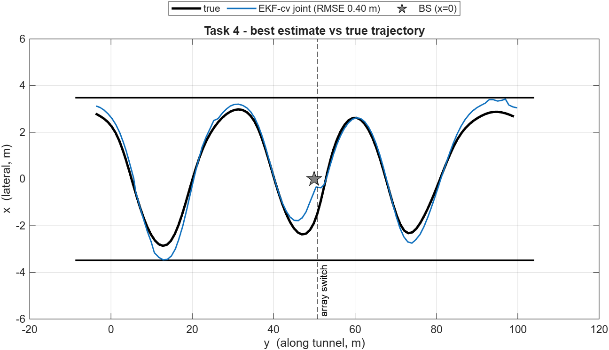
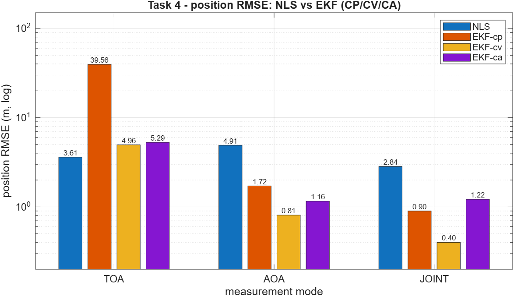
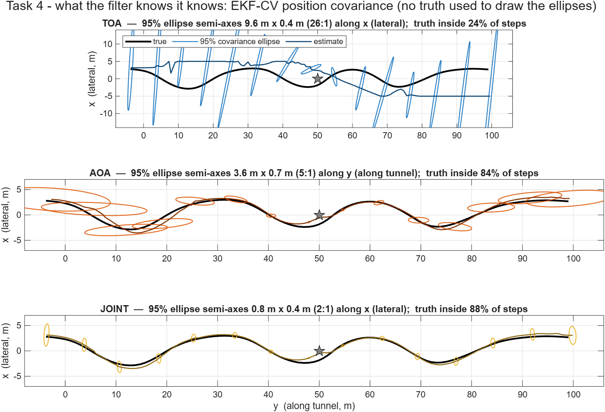

# Vehicle Localization & Tracking in a Highway Tunnel

MATLAB implementation of a vehicle localization and tracking system using **Time of Arrival (ToA)** and **Angle of Arrival (AoA)** measurements, **Nonlinear Least Squares (NLS)** positioning, and **Extended Kalman Filtering (EKF)**.

The project investigates how measurement modality, temporal filtering, and vehicle motion models affect localization accuracy in a multipath-rich highway tunnel scenario.

## Overview

A vehicle moves through a highway tunnel while a base station equipped with two antenna arrays provides multipath ToA and AoA measurements.

The project addresses four main problems:

1. Characterization of ToA/AoA measurement errors and multipath behavior
2. Snapshot localization using nonlinear least squares
3. Sequential tracking using Extended Kalman Filtering
4. Comparison of CP, CV, and CA vehicle motion models

The estimators are evaluated using **ToA-only, AoA-only, and joint ToA/AoA measurements**.

## Methodology

### Measurement Processing

Measured multipath rays are analyzed against reference rays to characterize range, azimuth, and elevation errors.

For EKF tracking, candidate measurements are associated with the predicted state using **Mahalanobis-distance gating**, improving robustness to multipath and outliers.

### Nonlinear Least Squares

A Gauss-Newton NLS estimator provides independent position estimates at each time step.

Three measurement configurations are evaluated:

- ToA
- AoA
- Joint ToA/AoA

### Extended Kalman Filter

The EKF combines nonlinear radio measurements with temporal vehicle dynamics.

Three motion models are implemented:

- **CP** — Constant Position
- **CV** — Constant Velocity
- **CA** — Constant Acceleration

Together with the three measurement modes, these models allow systematic evaluation of the effect of dynamics and measurement information on tracking accuracy.

## Key Result

The best-performing configuration was the **joint ToA/AoA EKF with a Constant Velocity motion model**.

| Metric | Result |
|---|---:|
| RMSE | **0.40 m** |
| 95th percentile error | **0.68 m** |
| Maximum error | **1.23 m** |



The results show that combining range and angular information with temporal filtering substantially improves localization robustness compared with snapshot estimation or single-measurement modalities.

## Estimator Comparison

The project evaluates **12 estimator configurations**:

- NLS with ToA, AoA, and joint measurements
- EKF-CP with ToA, AoA, and joint measurements
- EKF-CV with ToA, AoA, and joint measurements
- EKF-CA with ToA, AoA, and joint measurements



A detailed numerical comparison is available in [`results/metrics_table.csv`](results/metrics_table.csv).

## Uncertainty and Observability

EKF covariance matrices are used to construct 95% position-error ellipses.

This provides insight into estimator uncertainty and illustrates how ToA-only, AoA-only, and joint measurements constrain different spatial directions.



## Repository Structure

```text
wireless-vehicle-localization/
├── src/                 Core estimation and signal-processing functions
├── scripts/             Task scripts and end-to-end execution
├── results/
│   ├── figures/         Generated figures
│   └── metrics_table.csv
├── docs/                Project presentation
├── README.md
└── .gitignore
```

## Running the Project

The implementation requires MATLAB.

From the project root, run:

```matlab
run('scripts/run_all.m')
```

This executes the complete analysis pipeline and regenerates the project figures and evaluation metrics.

Reliability and consistency checks can be executed using:

```matlab
run('scripts/run_checks.m')
```

## Dataset

The dataset used for this project was provided as part of the **Localization, Navigation and Smart Mobility** course at Politecnico di Milano and is therefore not redistributed in this repository.

The code expects the dataset locally at:

```text
data/LNSM_project_data_2026.mat
```

## Validation

The implementation includes checks for:

- Measurement-model reproduction
- Analytical vs. numerical Jacobian consistency
- NLS convergence
- EKF innovation consistency
- Estimator determinism
- Initialization robustness
- Process-noise sensitivity
- Covariance consistency
- Numerical edge cases

## Technologies

**MATLAB · Wireless Positioning · ToA/AoA · Extended Kalman Filter · Nonlinear Least Squares · Sensor Fusion · Multipath Processing · Statistical Estimation**

## Academic Context

Developed as part of the **Localization, Navigation and Smart Mobility** course at **Politecnico di Milano**.

See [`docs/LNSM_Project_Presentation.pdf`](docs/LNSM_Project_Presentation.pdf) for the project presentation.
